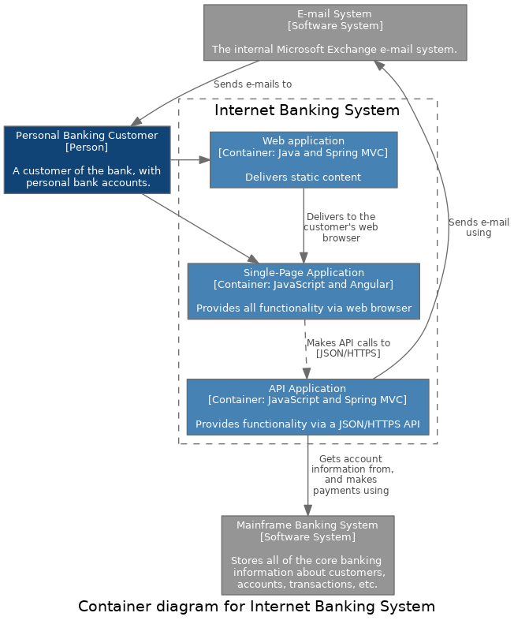

## C4models using python

Python interface for creating c4models using pydot.

### Installation

```
git clone https://github.com/equinor/c4model-python

pip install .
```

### Examples

#### C1


```python
from c4model import Model, Person, SoftwareSystem, Relationship

customer = Person(name='Personal Banking Customer',
                  description='A customer of the bank, with\n personal bank accounts.')

email = SoftwareSystem(name='E-mail System', description='The internal Microsoft Exchange e-mail system.',
                       is_external=True)
internet = SoftwareSystem(name='Internet Banking System',
                          description='Allows customers to view\n information about their bank\n accounts, and make payments.')
mainframe = SoftwareSystem(name='Mainframe Banking System',
                           description='Stores all of the core banking \n information about customers,\naccounts, transactions, etc.',
                           is_external=True)

c1 = (Model(name='c1', label='System Context diagram for Internet Banking System')
      .add_box(customer)
      .add_box(email)
      .add_box(mainframe)
      .add_box(internet)
      .add_relationship(
    Relationship(customer, internet, description='Views account\nbalances, and\nmakes payments\nusing'))
      .add_relationship(Relationship(internet, email, description='Sends e-mail\nusing'))
      .add_relationship(Relationship(email, customer, description='Sends e-mails to'))
      .add_relationship(
    Relationship(internet, mainframe, description='Gets account\n information from,\nand makes\npayments using'))
      .save()
      )
```

#### C2



```python
from c4model import Model, Person, SoftwareSystem, Container, Relationship, Submodel

customer = Person(name='Personal Banking Customer',
                  description='A customer of the bank, with\n personal bank accounts.')

email = SoftwareSystem(name='E-mail System', description='The internal Microsoft Exchange e-mail system.',
                       is_external=True)

webapp = Container(name='Web application', container_description='Java and Spring MVC',
                   description='Delivers static content')
spa = Container(name='Single-Page Application', container_description='JavaScript and Angular',
                description='Provides all functionality via web browser')
api = Container(name='API Application', container_description='JavaScript and Spring MVC',
                description='Provides functionality via a JSON/HTTPS API')

mainframe = SoftwareSystem(name='Mainframe Banking System',
                           description='Stores all of the core banking \n information about customers,\naccounts, transactions, etc.',
                           is_external=True)

banking_sub = (Submodel(label='Internet Banking System')
               .add_box(webapp)
               .add_box(spa)
               .add_box(api)
               .add_relationship(Relationship(webapp, spa, description="Delivers to the\ncustomer's web\nbrowser"))
               .add_relationship(Relationship(spa, api, description="Makes API calls to\n[JSON/HTTPS]", style='dashed'))
               )

c2 = (Model(name='c2', label='Container diagram for Internet Banking System')
      .add_box(customer)
      .add_box(email)
      .add_submodel(banking_sub)
      .add_box(mainframe)
      .add_relationship(Relationship(customer, webapp))
      .add_relationship(Relationship(customer, spa))
      .add_relationship(Relationship(api, email, description='Sends e-mail\nusing'))
      .add_relationship(Relationship(email, customer, description='Sends e-mails to'))
      .add_relationship(
    Relationship(api, mainframe, description='Gets account\n information from,\nand makes\npayments using'))
      .save()
      )
```
